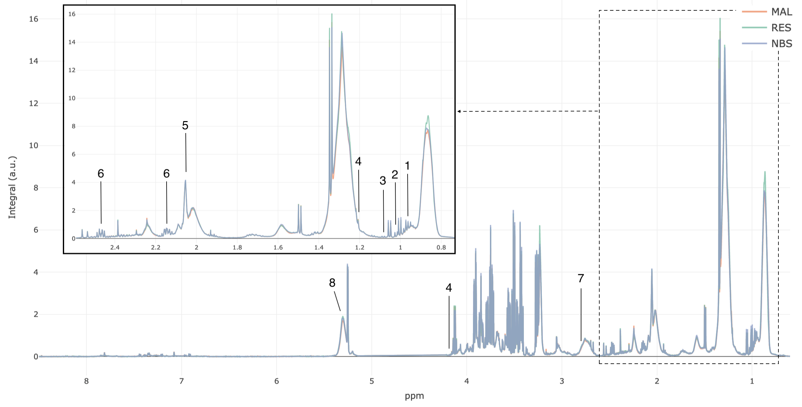
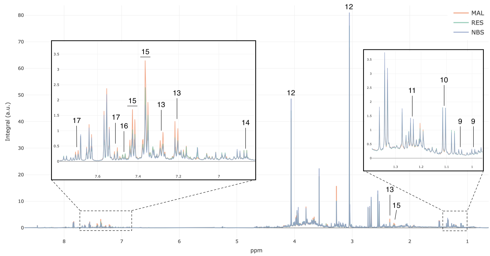
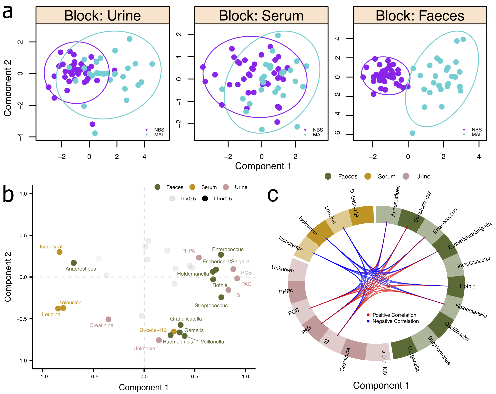
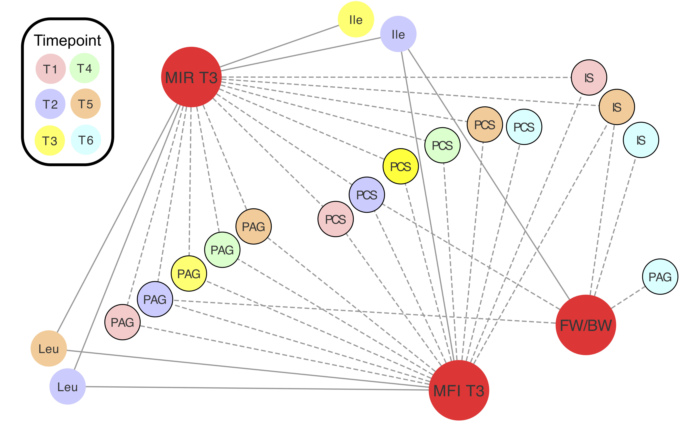

***

###### All code used to generate results within the manuscript and the supplementary files is contained here
* For all *P* values, an alpha of 0.05 was used
* The Benjamini-Hochberg method was used to control for false discovery rate   

***

Parameters
```{r parameters}

save_dir <- "output" # where to save figures and tables
if (!dir.exists(save_dir)) { stop(paste("save_dir", save_dir, "does not exist")) }

color_pal <- list(NBS = "purple", RES = "coral2", MAL = "darkturquoise")

```

```{r setup, include=FALSE}

knitr::opts_chunk$set(echo = TRUE, warning = FALSE, fig.align = "center")

pkgs <- c("tidyverse", "santaR", "phyloseq", "ggpubr", "ggplot2",
          "vegan", "DESeq2", "mixOmics", "Hmisc", "igraph", "ppcor", 
          "reshape2", "plotly")
lapply(pkgs, require, character.only = TRUE)

theme_set(theme_bw())

```

Load data
```{r}
load("PBS_data.Rdata")
ls()
```

### Figure S1: Summary of sampling by individual

Contribution of samples by study group at each time point

```{r figureS1}

mb <- data.frame(Patient.TP = sample_names(ps_M),
                 faeces = TRUE)

# order individuals by number of time points where samples were collected
ord <- table(integrals$Study.no) %>% 
  sort(decreasing = TRUE) %>% 
  names()

# which samples were collected for each individual at each time point
all_samples <- integrals %>%
  filter(Time_point != 7) %>%
  mutate(urine = ifelse(!is.na(PAG), TRUE, NA),
         serum = ifelse(!is.na(isoleucine), TRUE, NA)) %>%
  full_join(mb, by = "Patient.TP") %>%
  mutate(Sampling = case_when(urine == TRUE & serum == TRUE & faeces == TRUE ~ "Serum/Urine/Faeces",
                              urine == TRUE & serum == TRUE & is.na(faeces) ~ "Serum/Urine",
                              urine == TRUE & is.na(serum) & faeces == TRUE ~ "Urine/Faeces",
                              is.na(urine) & serum == TRUE & faeces == TRUE ~ "Serum/Faeces",
                              urine == TRUE & is.na(serum) & is.na(faeces) ~ "Urine only",
                              is.na(urine) & serum == TRUE & is.na(faeces) ~ "Serum only"),
         Sampling = factor(Sampling, levels = c("Serum/Urine/Faeces", "Serum/Urine", "Urine/Faeces", 
                                                "Serum/Faeces", "Urine only",  "Serum only")),
         Study.no = factor(Study.no, levels = ord))

```

Make plot

```{r plot_figureS1}

p <- ggscatter(all_samples, 
               x = "Study.no",
               xlab = "Individual",
               y = "Time_point_label",
               ylab = "Time point",
               color = "Sampling", 
               palette = c("chartreuse3", "mediumorchid3", "dodgerblue", 
                           "darkorange", "gold2", "red3"),
               size = "Obesity") +
  theme(axis.text.x = element_blank(), 
        axis.ticks.x = element_blank(),
        legend.spacing.x = unit(2, "mm"),
        legend.title = element_blank()) +
  grids(linetype = "dashed", axis = "x", color = "grey")

p <- facet(p, facet.by = "Group", scales = "free", ncol = 1)

```

```{r save_figureS1, echo=FALSE, fig.width=12, fig.height=7}

ggsave(p, 
       filename = file.path(save_dir, "figureS1_sampling_summary.pdf"),
       width = 14, height = 8)
p

```

### Figures S2 and S5: Overlayed median 1H NMR spectra

Serum (Figure S2) and urine (Figure S5) median spectra were overlayed for the three study groups

```{r med_spec}

plot_med_specs <- function(to_plot, save_dir, save_name) {
  
  p <- plot_ly(to_plot, x = ~ppm, y = ~MAL, name = "MAL", type = "scatter", 
               mode = "lines", alpha = 0.8, color = color_pal$MAL) %>%
    add_trace(y = ~RES, name = "RES", mode = "lines", alpha = 0.8, color = color_pal$RES) %>%
    add_trace(y = ~NBS, name = "NBS", mode = "lines", alpha = 0.8, color = color_pal$NBS) %>%
    layout(xaxis = list(autorange = "reversed", size = 18),
           yaxis = list(title = "Integral (a.u.)", size = 18))
  
  htmlwidgets::saveWidget(p, file = file.path(getwd(), save_dir, save_name))
}

# serum
plot_med_specs(med_specs_serum, save_dir, "figureS2_median_spectra_serum.html")

# urine
plot_med_specs(med_specs_urine, save_dir, "figureS5_median_spectra_urine.html")

```  

Figure S2 (annotated)
  
Figure S5 (annotated)

*Key: 1 leucine; 2 isoleucine; 3 isobutyrate; 4 D-β-hydroxybutyrate ; 5 N- acetyl glycoprotein (GlycA) ; 6 glutamine ; 7 lipids (C=CCH2C=C) ; 8 unsaturated lipids (CH=CH); 9 valine; 10 α-ketoisovalerate; 11 methylmalonate; 12 creatinine; 13 p-cresol sulfate; 14 p-hydroxyphenylacetate; 15 phenylacetylglutamine; 16 unknown; 17 indoxyl sulfate*

### Figure 1: Longitudinal modelling of metabolite concentrations

Metabolites were considered discriminatory (malabsorptive vs control) if their NMR peaks were correlated (>=0.45) with the predictive component of a valid OPLS-DA model at any time point. A representative peak for each metabolite was integrated to calculate relative concentration.    

The behavior of key discriminatory metabolites over time was assessed and compared between control and malabsorptive groups using `santaR` time-series analysis.   
   
**Abbreviations**: PAG: phenylacetylglutamine, PCS: *p*-cresol sulfate, IS: indoxyl sulfate, PHPA: *p*-hydroxyphenylacetate, unkn: unknown, aKIV: α-ketoisovalerate, MM: methylmalonate, THB: D-β-hydroxybutyrate, NAGP: N-acetyl glycoprotein  

```{r figure1_serum_input}

################## DEFINED VARIABLES ##################

# remove restrictive group
input_data <- subset(integrals, integrals$Group != "Restrictive" & integrals$Time_point != 7)

# column names
metab_names <- c("leucine", "isoleucine", "isobutyrate", "NAGP", "glutamine", "THB")
tp_col <- "Time_point"
patient_col <- "Study.no"
group_col <- "Group"

tp_labs <- c("T1", "T2", "T3", "T4", "T5", "T6")

plot_titles <- c("Serum - Leucine", 
                 "Serum - Isoleucine", 
                 "Serum - Isobutyrate", 
                 "Serum - GlycA", 
                 "Serum - Glutamine", 
                 "Serum - D-beta-hydroxubutyrate")

# see santaR vignette for choosing this value 
degrees_freedom <- 5

# add custom locations (y axis) on plots for p values 
pval_locs = c(27, 20, 2.1, 5.0, 8.0, 17)

###########################################################

```

Serum metabolites

```{r time_series_serum, message=FALSE}

# run santaR time series analysis
sp <- santaR_auto_fit(inputData = input_data[,metab_names], ind = input_data[[patient_col]], 
                      time = as.numeric(input_data[[tp_col]]), group = input_data[[group_col]], 
                      df = degrees_freedom)

# generate a plot for each metabolite
for (metab in 1:length(metab_names)) {
  
  p <- santaR_plot(sp[[metab_names[metab]]], 
                   showIndPoint=FALSE, 
                   showIndCurve=FALSE, 
                   xlab = NULL, 
                   ylab = NULL, 
                   colorVect = unlist(color_pal[-2]), 
                   title = plot_titles[metab]) +
    scale_x_continuous(breaks = 1:length(tp_labs), 
                       labels = tp_labs) +
    theme(plot.title = element_text(size = 6), 
          legend.position = "None", 
          axis.text = element_text(size = 5),
          panel.grid.major = element_blank(), 
          panel.grid.minor = element_blank()) +
    # add p value
    annotate("text",
             size = 2,
             x = 5,
             y = pval_locs[metab],
             label = paste("P = ", round(sp[[metab_names[metab]]]$general$pval.dist, digits = 4)))
  
  assign(metab_names[metab], p)
}

```

Urine metabolites

```{r figure1_urine_input}

################## DEFINED VARIABLES ##################

# remove restrictive group
input_data <- subset(integrals, integrals$Group != "Restrictive" & integrals$Time_point != 7)

# column names
metab_names <- c("PAG", "PCS", "IS", "PHPA", "unkn", "valine", "aKIV", "MM", "creatinine")
tp_col <- "Time_point"
patient_col <- "Study.no"
group_col <- "Group"

tp_labs <- c("T1", "T2", "T3", "T4", "T5", "T6")

plot_titles <- c("Urine - PAG", 
                 "Urine - PCS", 
                 "Urine - IS", 
                 "Urine - PHPA", 
                 "Urine - Unknown", 
                 "Urine - Valine", 
                 "Urine - alpha-Ketoisovalerate", 
                 "Urine - Methylmalonate", 
                 "Urine - Creatinine")

# see santaR vignette for choosing this value 
degrees_freedom <- 5

# add custom locations (y axis) on plots for p values 
pval_locs = c(28, 75, 6.5, 6.5, 13, 12, 22, 12, 550)

###########################################################

```

```{r time_series_urine, message=FALSE}

# run santaR time series analysis
sp <- santaR_auto_fit(inputData = input_data[,metab_names], ind = input_data[[patient_col]], 
                      time = as.numeric(input_data[[tp_col]]), group = input_data[[group_col]], 
                      df = degrees_freedom)

# generate a plot for each metabolite
for (metab in 1:length(metab_names)) {
  
  p <- santaR_plot(sp[[metab_names[metab]]], 
                   showIndPoint=FALSE, 
                   showIndCurve=FALSE, 
                   xlab = NULL, 
                   ylab = NULL, 
                   colorVect = unlist(color_pal[-2]), 
                   title = plot_titles[metab]) +
    scale_x_continuous(breaks = 1:length(tp_labs), 
                       labels = tp_labs) +
    theme(plot.title = element_text(size = 6), 
          legend.position = "None", 
          axis.text = element_text(size = 5),
          panel.grid.major = element_blank(), 
          panel.grid.minor = element_blank()) +
    # add p value
    annotate("text",
             size = 2,
             x = 5,
             y = pval_locs[metab],
             label = paste("P = ", round(sp[[metab_names[metab]]]$general$pval.dist, digits = 4)))
  
  assign(metab_names[metab], p)
}

```

(1b) Relative concentration of PAG was also higher in neonatal urine from malabsorptive group.

```{r pag_baby}

pb <- ggboxplot(integrals, 
                x = "Group_label",
                y = "PAG_B", 
                color = "Group_label", 
                ylim = c(-1,11), 
                add = "jitter",
                size = 0.25, 
                add.params = list(size = 0.5),
                palette = unlist(color_pal), 
                legend = "none", 
                xlab = FALSE, 
                ylab = "Integral (a.u.)",
                title = "Neonatal Urine - PAG") +
  theme(axis.text=element_text(size = 5), 
        axis.title = element_text(size = 6),
        plot.title = element_text(size = 8, hjust = 0.5)) +
  # add significance
  stat_compare_means(comparisons = list(c("NBS", "MAL"), c("RES", "MAL")), 
                     label.y = c(7, 9.5),
                     label.y.npc = "bottom",
                     label =  "p.signif", 
                     method = "wilcox.test")

``` 

Combine maternal (1a) serum, urine, and neonatal (1b) urine plots

```{r figure1}

p <- ggarrange(leucine, isoleucine, isobutyrate ,NAGP, glutamine, THB, 
               PAG, PCS, IS, PHPA, unkn, valine, aKIV, MM, creatinine, pb)
    
fig1 <- annotate_figure(p,
                     left = text_grob("Integral (a.u.)", 
                                      size = 10, rot = 90), 
                     bottom = text_grob("Time point", 
                                        size = 10))

```

```{r save_fig1, echo=FALSE, out.width="120%"}

ggsave(fig1, 
       filename = file.path(save_dir, "figure1_time_series_metab.pdf"), 
       width = 175, 
       height = 150, 
       units = "mm")
fig1

```

### Table S5: Maternal metabolic changes depend on type of bariatric surgery

Relative concentration changes for each discriminatory metabolite were detailed at all time points for both malabsorptive and restrictive groups.

```{r tableS5_inputs}

################## DEFINED VARIABLES ##################

# input dataframe has one row for each sample, one column for each metabolite (with concentrations or integrals)
input_data <- integrals

# metabolites of interest (match column names in input data)
metab_names <- c("PAG", "PCS", "IS", "PHPA", "unkn", "creatinine", "aKIV", "MM", "valine",
                 "isoleucine", "leucine", "isobutyrate", "glutamine", "THB", "NAGP")

# column name for time point
tp_col <- "Time_point_label"

# time points to include
time_points <- c("T1", "T2", "T3", "T4", "T5", "T6")

# column name for group
group_col <- "Group"

# case group name
case_names <- c("Restrictive", "Malabsorptive") # function only takes one input group, use for loop

# control group name
con_name <- "No Bariatric Surgery"

###########################################################

```

Generate table: log<sub>2</sub>(Fold Change) was calculated where Fold Change (FC) = mean(case)/mean(control). *P* values are from Mann-Whitney U test. 

```{r tableS5_fxn}

univariate_metabolites <- function(input_data, 
                                   metab_names, 
                                   tp_col, 
                                   time_points, 
                                   group_col, 
                                   case_name, 
                                   con_name) { 
  # subset data to comparison groups
  input_data <- subset(input_data, input_data[[group_col]] %in% c(case_name, con_name))
  
  # create empty matrices to store results
  log2FC <- as.data.frame(matrix(nrow = length(time_points), ncol = length(metab_names))) %>%
    set_colnames(metab_names) %>%
    set_rownames(time_points)
  
  pval <- as.data.frame(matrix(nrow = length(time_points), ncol = length(metab_names))) %>%
    set_colnames(metab_names) %>%
    set_rownames(time_points)
  
  # Calculate log2(FC) for each metabolite at time points T1 - T6
  for (time in time_points){
    data <- subset(input_data, input_data[[tp_col]] == time)
    con <- subset(data, data[[group_col]] == con_name)
    case <- subset(data, data[[group_col]] == case_name)
    for (metab in metab_names){
      log2fc <- round(log2(mean(case[,metab], na.rm = T)/mean(con[,metab], na.rm = T)), digits = 3)
      log2FC[time,metab] <- log2fc
    }}
  
  # Calculate p value for each metabolite at time points T1 - T6
  for (time in time_points){
    for (metab in metab_names){ 
      data <- subset(input_data, 
                     input_data[[tp_col]] == time & input_data[[group_col]] %in% c(case_name, con_name))
      form <- formula(paste(metab, "~", group_col))
      pval[time,metab] <- wilcox.test(form, data, exact = FALSE)$p.value
    }}
  
  # adjust p values
  log2FC.list <- data.frame(Time_point = rep(time_points, length(metab_names)),
                            bind_cols(gather(log2FC, "Metabolite", "log2FC"), 
                                      gather(pval, "Metab", "p.val")))
  log2FC.list$p.adj.BH <- p.adjust(log2FC.list$p.val, method = "BH")
  log2FC.list$Group <- case_name
  return(log2FC.list[,-which(colnames(log2FC.list) == "Metab")])
}

```

Generate table for each case group

```{r tableS5}

tableS5 <- NULL
for (gr in case_names) {
  idx <- univariate_metabolites(input_data, 
                                metab_names, 
                                tp_col, 
                                time_points, 
                                group_col, 
                                case_name = gr, 
                                con_name)
  tableS5 <- rbind(tableS5, idx)
}

```

Format table

```{r format_tableS5}

# change p values to scientific notation
tableS5_formatted <- tableS5 %>%
  mutate(P = formatC(tableS5$p.val, format = "e", digits = 2),
            Padj = formatC(tableS5$p.adj.BH, format = "e", digits = 2))

# change non-significant p values to NS
tableS5_formatted$P[as.numeric(tableS5_formatted$P) > 0.05] <- "NS"
tableS5_formatted$Padj[as.numeric(tableS5_formatted$Padj) > 0.05] <- "NS"

```

```{r save_tableS5, echo=FALSE}

write.csv(tableS5_formatted[,c("Metabolite","Time_point","Group","log2FC","P","Padj")], 
          file = file.path(save_dir, "tableS5_metabolic_changes.csv"), row.names = F)

```

### Figure S3: Maternal metabolic changes depend on type of bariatric surgery

Graphical representation of the changes

```{r figS3_inputs}

################## DEFINED VARIABLES ##################

input_data <- tableS5_formatted %>%
  # label significant data
  mutate(plot_sig = ifelse(Padj == "NS", NA, "*"),
         Group_label = case_when(Group == "Malabsorptive" ~ "MAL",
                                 Group == "Restrictive" ~ "RES"),
         # Change names for plot titles
         Metabolite = plyr::mapvalues(Metabolite,
                                      from = c("THB", "NAGP", "unkn", "aKIV", "MM", "glutamine",
                                               "creatinine", "isobutyrate", "leucine", "isoleucine",
                                               "valine"),
                                      to = c("D-beta-hydroxybutyrate", "GlycA",
                                             "Unknown", "alpha-Ketoisovalerate", "Methylmalonate",
                                             "Glutamine", "Creatinine", "Isobutyrate", "Leucine", 
                                             "Isoleucine", "Valine")),
         # order time points
         Time_point = factor(Time_point, levels = c("T6", "T5", "T4", "T3", "T2", "T1")),
         # add which biofluid metabolites were identified in
         biofluid = ifelse(Metabolite %in% c("PAG", "PCS", "IS", "PHPA", "Unknown", "Valine", 
                                             "Creatinine", "alpha-Ketoisovalerate", "Methylmalonate"),
                           "urine",
                           "serum"))

# column names
tp_col <- "Time_point"
metab_col <- "Metabolite"
s_type_col <- "biofluid"
group_col <- "Group_label"
plot_val <- "log2FC"
label_sig <- "plot_sig"

figure_labels <- list(serum = "a", urine = "b")

###########################################################

```

Plot effect sizes and significance

```{r, include=FALSE}

# amended ggpubr function ggdotchart() so that the values are not automatically ordered
source("ggdotchart_not_ordered.R")
source("utilities.R")

```

```{r plot_metabolites}

for (s_type in names(figure_labels)) {
    
    # subset to appropriate biofluid type
    to_plot <- subset(input_data, input_data[[s_type_col]] == s_type)
    
    # plot log2FC for both groups
    p <- ggdotchart_not_ordered(to_plot,
                                x = tp_col,
                                xlab = "",
                                y = plot_val, 
                                ylab = "",
                                rotate = TRUE,
                                color = group_col,
                                palette = unlist(color_pal), 
                                dot.size = 1.5,
                                label = label_sig,
                                font.label = list(color = "black", 
                                                  size = 10,
                                                  vjust = 0.72),
                                add = "segments",
                                add.param = list(color = "lightgray", 
                                                 size = 0.4)) +
      ylim(c(min(to_plot$log2FC), max(to_plot$log2FC))) + 
      geom_hline(yintercept = 0, 
                 linetype = 2, 
                 size = 0.4,
                 color = "lightgray") +
      theme(legend.title = element_blank(),
            legend.text=element_text(size = 6), 
            legend.key.size = unit(3, "mm"),
            axis.text=element_text(size = 5), 
            axis.line = element_line(size = 0.4),
            axis.ticks = element_line(size = 0.4)) +
      rotate_x_text(55)
    
    # separate plots for each metabolite
    p <- facet(p,
               facet.by = metab_col,
               nrow = 2,
               scales = "free_x",
               panel.labs.background = list(fill = "ivory2", 
                                            color = "black"),
               panel.labs.font = list(size = 4, 
                                      face ="bold"))
    
    # add figure labels and axis annotations
    p <- annotate_figure(p, 
                         fig.lab.pos = "top.left", 
                         fig.lab = figure_labels[[s_type]], 
                         fig.lab.size = 10, 
                         fig.lab.face = "bold",
                         left = text_grob("Time point", 
                                          size = 6, 
                                          rot = 90, vjust = 4), 
                         bottom = text_grob("log2(Fold Change)", 
                                            size = 6, vjust = -4))
    
    assign(paste0(s_type, "_dotplot"), p)
}

```

Combine serum and urine plots

```{r figS3}

figS3 <- ggarrange(serum_dotplot, urine_dotplot, 
                  ncol = 2,
                  widths = c(1, 1.5))

```

```{r save_figS3, echo=FALSE, out.width="110%"}

ggsave(figS3, 
       filename = file.path(save_dir, "figureS3_metabolic_changes.pdf"), 
       width = 180, 
       height = 100, 
       units = "mm")
figS3

```

### Figure S7: Relative concentrations of urinary host-microbial co-metabolites vary depending on bariatric surgery sub-type

Comparison of key discriminatory metabolites between study sub-groups.

```{r figureS7_input}

################## DEFINED VARIABLES ##################

input_data <- integrals %>%
  # separate restrictive group into band and sleeve
  mutate(Group_label = case_when(Group_label == "NBS" ~ "NBS",
                                 Group_label == "MAL" ~ "MAL",
                                 Group_label == "RES" & Bariatric.surgery == "BAND" ~ "BAND",
                                 Group_label == "RES" & Bariatric.surgery == "SLEEVE" ~ "SLEEVE")) %>%
  # order sub-groups
  mutate(Group_label = factor(Group_label, levels = c("NBS", "BAND", "SLEEVE", "MAL"))) %>%
  # remove neonatal samples
  filter(Time_point_label != "T7")

# column names
metab_names <- c("PAG", "PCS", "IS", "PHPA", "unkn")
tp_col <- "Time_point_label"
group_col <- "Group_label"

colors <- list(NBS = "purple", BAND = "coral2", SLEEVE = "coral2", MAL = "darkturquoise")

###########################################################

```

For each metabolite, plot relative concentrations at each time point.

```{r plot_subgroups}

for (metab in metab_names) {
  for (tp in unique(input_data[[tp_col]])) {
    p <- ggboxplot(subset(input_data, input_data[[tp_col]] == tp),
                   size = 0.2,
                   group_col, 
                   metab,
                   color = group_col,
                   palette = unlist(colors),
                   add = "jitter",
                   add.params = list(alpha = 0.5,
                                     size = 0.3),
                   xlab = FALSE,
                   ylab = paste(metab, tp)) +
      theme(legend.position = "None",
            axis.text=element_text(size = 5), 
            axis.title = element_text(size = 6), 
            axis.line = element_line(size = 0.4),
            axis.ticks = element_line(size = 0.4)) +
      rotate_x_text(angle = 45)
    p$layers[[1]]$geom_params$outlier.size <- 0.3 # change size of outlier points
    assign(paste0(metab, "_", tp, "_boxplot"), p)
  }
}

```

Combine all plots together

```{r figureS7}

figS7 <- ggarrange(PAG_T1_boxplot, PAG_T2_boxplot, PAG_T3_boxplot, PAG_T4_boxplot, 
                   PAG_T5_boxplot, PAG_T6_boxplot, PCS_T1_boxplot, PCS_T2_boxplot, 
                   PCS_T3_boxplot, PCS_T4_boxplot, PCS_T5_boxplot, PCS_T6_boxplot,
                   IS_T1_boxplot, IS_T2_boxplot, IS_T3_boxplot, IS_T4_boxplot, 
                   IS_T5_boxplot, IS_T6_boxplot, PHPA_T1_boxplot, PHPA_T2_boxplot, 
                   PHPA_T3_boxplot, PHPA_T4_boxplot, PHPA_T5_boxplot, PHPA_T6_boxplot,
                   unkn_T1_boxplot, unkn_T2_boxplot, unkn_T3_boxplot, unkn_T4_boxplot, 
                   unkn_T5_boxplot, unkn_T6_boxplot)

```

```{r save_figureS7, echo=FALSE, out.width="120%"}

ggsave(figS7, filename = file.path(save_dir, "figureS7_metab_BS_subgroup.pdf"), height = 150, width = 170, units = "mm")
figS7

```

### Figure 2: Gut bacterial alterations in malabsorptive patients

```{r figure2_inputs}

################## DEFINED VARIABLES ##################

# input data is phyloseq object
input_data <- ps_M

# column names
tp_col <- "Time_point_label"
group_col <- "Group_label"

adiv_measure <- "Shannon"
bdiv_measure <- "bray"
ordination_meth <- "MDS"

set.seed(71)

###########################################################

```

Calculate alpha-diversity

```{r a_div}

# normalize by rarefying to minimum sequencing depth
data <- input_data %>%
  rarefy_even_depth(sample.size = min(sample_sums(input_data)), verbose = FALSE, replace = FALSE)

# calculate alpha diversity
alpha_div <- estimate_richness(data, split = TRUE, measures = adiv_measure)

# add variables needed for plot
alpha_div$Time_point <- sample_data(data)[[tp_col]]
alpha_div$Group <- sample_data(data)[[group_col]]

```

Calculate beta-diversity

```{r b_div}

# use log transformation normalization to overcome differences in sequencing depth
data <- input_data %>%
  transform_sample_counts(function(x) {log(x+1)})

bdiv <- phyloseq::distance(data, bdiv_measure)
MDS <- ordinate(data, ordination_meth, bdiv)

# extract % variance explained for axis labels
ord <- plot_ordination(data, MDS)[["labels"]] 

```

(2a) Comparison of Shannon Index between malabsorptive and control groups

```{r figure2a}

am <- facet(ggboxplot(alpha_div, 
               x = "Group", 
               y = adiv_measure, 
               color = "Group", 
               add = "jitter",
               add.params = list(alpha = 0.5),
               size = 0.5,
               palette = unlist(color_pal), 
               legend = "none", 
               ylim = c(3.3,5.2), 
               xlab = FALSE,
               ylab = "Shannon's Diversity Index (H)") +
              theme(axis.text = element_text(size = 6), 
                    axis.title = element_text(size = 6)) + 
              # add significance
              stat_compare_means(comparisons = list(c("NBS", "MAL")), 
                                 label =  "p.signif", 
                                 method = "wilcox.test", 
                                 label.y = 5.1,
                                 hide.ns = TRUE),
            facet.by = "Time_point",
            panel.labs.background = list(fill = "ivory2", color = "black"), 
            panel.labs.font = list(size = 7, face ="bold"))

```

(2b) Bray-Curtis dissimilarity with PCoA ordination

```{r figure2b}

# plot PCoA
to_plot <- plot_ordination(data, MDS, justDF = TRUE)
bm <- ggscatter(to_plot, 
                x = "Axis.1", 
                y = "Axis.2", 
                color = "Group_label", 
                alpha = 0.6,
                ggtheme = theme_bw(), 
                shape = "Time_point_label",
                size = 1.5,
                ellipse = TRUE, 
                ellipse.level = 0.95, 
                ellipse.type = "norm", 
                ellipse.alpha = 0) +
  scale_colour_manual(values = unlist(color_pal)) +
  labs(x = str_replace(ord$x, "Axis.1  ", "PC1"), 
       y = str_replace(ord$y, "Axis.2  ", "PC2")) +
  theme(legend.position = "none", 
        axis.title =element_text(size=6), 
        axis.text = element_text(size = 6)) 

# permanova test
adonis_res <- adonis(bdiv ~ Group, data.frame(sample_data(data))) 

# add permanova p value
bm <- bm +
  annotate("text",
           size = 2,
           x = 0.3,
           y = 0.32,
           label = paste("P = ", round(adonis_res$aov.tab$`Pr(>F)`[1], digits = 4)))

# put 2a and 2b together
plot1 <- ggarrange(am, bm, labels = c("a", "b"), widths = c(2,1))

```

(2c) Differential abundance (malabsorptive vs control) at each taxonomic level. Effect sizes are log<sub>2</sub>(FC) and *P* values are from Mann-Whitney U test.

```{r figure2c_inputs}

################## DEFINED VARIABLES ##################

# input data is phyloseq object
data <- ps_M

tp_col <- "Time_point_label"
time_points <- c("T1", "T2", "T4")

group_col <- "Group_label"
case_name <- "MAL"
con_name <- "NBS"

# 16S data transformation parameters
# taxa without at least min_counts in at least prev_filt (%) of samples will be removed
min_counts <- 5
prev_filt <- 0.1

###########################################################

```

Generate differential abundance table (Table S6)

```{r diff_abund}

MWU <- NULL

for (rank in c("Phylum", "Class", "Order", "Family", "Genus")){ 
  for (time in time_points){ 
    
    ps_obj <- data %>%
      tax_glom(rank) %>%
      # prevalence filter
      filter_taxa(function(x) sum(x > min_counts) > (prev_filt*length(x)), TRUE) %>%
      # normalize by total sum scaling
      transform_sample_counts(function(x) x/sum(x)) %>%
      # subset to time point
      subset_samples(Time_point_label == time)

    tax <- data.frame(as(tax_table(ps_obj), "matrix"))
    abund <- data.frame(as(otu_table(ps_obj), "matrix")) %>%
      # change column names to names at current rank
      set_colnames(gsub("/", ".", tax[,which(colnames(tax)==rank)]))
    # add group column
    abund$Group <- sample_data(ps_obj)[[group_col]]
    
    # test differences between groups for every taxon
    for (i in c(1:(ncol(abund)-1))) {
      taxa <- colnames(abund)[1:(ncol(abund)-1)]
      form <- formula(paste(taxa[i], "~ Group"))
      mw <- wilcox.test(form, abund, exact = FALSE)
      idx <- tibble(Rank = rank,
                    Time_point = time,
                    Taxon = taxa[i],
                    Mean_rel_abund_case = mean(subset(abund, abund$Group == case_name)[,i]),
                    Mean_rel_abund_cont = mean(subset(abund, abund$Group == con_name)[,i]),
                    pval = mw$p.value,
                    log2FC = log2(mean(subset(abund, abund$Group == case_name)[,i])/
                                    mean(subset(abund, abund$Group == con_name)[,i]))
      )
      MWU <- rbind(MWU, idx)
    }
  }
}

# multiple hypothesis testing correction
MWU$p.adj.BH <- p.adjust(MWU$pval, method = "BH")

# filter to significant taxa; excluding taxa that are not observed in a group (zero counts)
MWU_filt <- subset(MWU, MWU$p.adj.BH < 0.05 & abs(MWU$log2FC) != Inf)

```

```{r save_tableS6, echo=FALSE}

write.csv(MWU_filt, file.path(save_dir, "tableS6_changes_in_taxa_abund.csv"), row.names = F)

```

Barplots for each rank

```{r figure2c}

# color related taxa
palette <- list(Proteobacteria = "cyan4", 
                Bacilli = "khaki4", 
                Actinomycetales = "chocolate3", 
                Anaerostipes = "thistle4",  
                NS = "grey")

diff_abund <- MWU %>%
  # add x-axis plot label
  mutate(Label = str_replace(paste0(Taxon, "_", Time_point),
                             "Escherichia\\.", "Escherichia/"),
         # group taxa for coloring
         Taxa_group = case_when(p.adj.BH > 0.05 ~ "NS",
                                grepl("Proteobact|Gammaprot|Enterobacteria|Escherichia|Pasteurell|Haemophil", 
                                      Taxon) ~ "Proteobacteria",
                                Taxon %in% c("Micrococcaceae", "Rothia", "Actinomycetales") ~ "Actinomycetales",
                                grepl("Bacill|Enteroc|Strepto|Lactobacill|Carnobact|Granulicat", 
                                      Taxon) ~ "Bacilli",
                                grepl("Bacteroid|Butyricimonas", Taxon) ~ "Bacteroidetes",
                                Taxon == "Anaerostipes" ~ "Anaerostipes",
                                grepl("Holdeman|Solobact", Taxon) ~ "Erysipelotrichaceae",
                                grepl("Veillonella|Acidaminococcus", Taxon) ~ "Negativicutes",
                                grepl("Clostrid", Taxon) ~ "Clostridia"))

# factor for correct ordering on plot
diff_abund$Rank <- factor(diff_abund$Rank, levels = c("Phylum", "Class", "Order", "Family", "Genus"))
diff_abund$Taxa_group <- factor(diff_abund$Taxa_group, levels = c("Proteobacteria", 
                                                                  "Bacilli", 
                                                                  "Bacteroidetes", 
                                                                  "Clostridia", 
                                                                  "Negativicutes", 
                                                                  "Actinomycetales", 
                                                                  "Erysipelotrichaceae", 
                                                                  "Anaerostipes", 
                                                                  "NS"))

# remove taxa only significant at one time point
MWU_plot <- subset(diff_abund, diff_abund$Taxon %in%
                               names(which(table(MWU_filt$Taxon) > 1))) 

# top barplots
p <- ggbarplot(subset(MWU_plot, MWU_plot$Rank %in% c("Phylum", "Class", "Order")), 
              x = "Label", 
              y = "log2FC", 
              lab.size = 4,
              fill = "Taxa_group",           
              color = "white",            
              palette = unlist(palette),           
              ylab = "log2(Fold Change)", 
              lab.vjust = .5,
              xlab = FALSE, 
              order = sort(MWU_plot$Label)) +
  theme(axis.title = element_text(size=6), 
        axis.text = element_text(size = 6), 
        legend.position = "none") +
  rotate_x_text(55) 

p <- facet(p,
           facet.by = "Rank", 
           scales = "free_x", 
           nrow = 1, 
           space = "free_x", 
           panel.labs.background = list(fill = "ivory2", color = "black"), 
           panel.labs.font = list(size = 8, face ="bold"))

# bottom barplots
q <- ggbarplot(subset(MWU_plot, MWU_plot$Rank %in% c("Family", "Genus")), 
              x = "Label", 
              y = "log2FC", 
              lab.size = 4,
              fill = "Taxa_group",           
              color = "white",            
              palette = unlist(palette),           
              ylab = "log2(Fold Change)", 
              lab.vjust = .5,
              xlab = FALSE, 
              order = sort(MWU_plot$Label)) +
  theme(axis.title = element_text(size=6), 
        axis.text = element_text(size = 6), 
        legend.position = "right", 
        legend.text = element_text(size = 6), 
        legend.title = element_text(size = 8), 
        legend.key.size = unit(4, "mm")) +
  rotate_x_text(55) + 
  geom_hline(yintercept = 0, linetype="dashed", size = 0.4)

q <- facet(q,
           facet.by = "Rank", 
           scales = "free_x", 
           nrow = 1, 
           space = "free_x", 
           panel.labs.background = list(fill = "ivory2", color = "black"), 
           panel.labs.font = list(size = 7, face ="bold"))

# combine barplots
plot2 <- ggarrange(p, q, nrow = 2)

```

Combine (2c) with (2a) and (2b)

```{r fig2}

fig2 <- ggarrange(plot1, plot2, 
                 nrow = 2, 
                 heights = c(1.2,2), 
                 labels = c("", "c"))

```

```{r save_fig2, echo=FALSE, fig.height=6, fig.width=9}

ggsave(fig2, 
       filename = file.path(save_dir, "figure2_microbiome.pdf"), 
       width = 180, 
       height = 150, 
       units = "mm")
fig2

```

### Table S7: Differentially abundant amplicon sequence variants

Differential abundance of amplicon sequence variants was assessed by DESeq2. Taxonomic assignments at species level were compared between SILVA and RDP databases.

```{r tableS7_inputs}

################## DEFINED VARIABLES ##################

input_data <- merge_samples(ps_M, "Study.no")

# fix group labels - merging samples changes labels to numbers
sample_data(input_data)$Group <- str_replace_all(sample_data(input_data)$Group,
                                              c("1" = "Control",
                                              "2" = "Malabsorptive"))
sample_data(input_data)$Group <- factor(sample_data(input_data)$Group, levels = c("Control", "Malabsorptive"))

# 16S data transformation parameters
# taxa without at least min_counts in at least prev_filt (%) of samples will be removed
min_counts <- 5
prev_filt <- 0.1

alpha <- 0.05

gen <- c("Enterococcus", "Escherichia/Shigella", "Streptococcus", "Rothia")

###########################################################

```

Make table with differential abundance and species assignments

```{r tableS7, message=FALSE}

# prevalence filter
ps_trim <- input_data %>%
  filter_taxa(function(x) sum(x > min_counts)> (prev_filt*length(x)), TRUE)

# run DESeq2
DDS <- phyloseq_to_deseq2(ps_trim, ~ Group)
DDS <- estimateSizeFactors(DDS, type = "poscounts")
DDS <- estimateDispersions(DDS, fitType = "local")
DDS <- DESeq(DDS, fitType = "local")

# results
res <- results(DDS)
res <- res[order(res$padj, na.last=NA), ]

sigtab <- res[(res$padj < alpha), ]
sigtab <- cbind(as(sigtab, "data.frame"), as(tax_table(ps_trim)[rownames(sigtab), ], "matrix"))

# keep only genera of interest
sigtab <- subset(sigtab, sigtab$Genus %in% gen)
keep <- which(row.names(rdp.species) %in% row.names(sigtab))

rdp.species <- data.frame(rdp.species)
rdp.species$seq <- row.names(rdp.species)
silva.species <- data.frame(silva.species)
silva.species$seq <- row.names(silva.species)

# combine RDP and SILVA species assignments
species_assign <- merge(rdp.species[keep, c(6:8)], silva.species[keep, c(6:8)], by = "seq")

# combine DESeq2 results with species assignments
sigtab$seq <- row.names(sigtab)
species_assign <- merge(sigtab[,c(1:6,13)], species_assign, by = "seq")

```

```{r save_tableS7, echo=FALSE}

write.csv(species_assign, file.path(save_dir, "tableS7_diff_abund_asv.csv"))

```

### Figure 3: Integration of serum, urine and faecal profiles

Relative concentrations of key discriminatory metabolites were integrated with genera abundances using "DIABLO", a method implemented in `mixOmics`.

```{r figure3_inputs}

################## DEFINED VARIABLES ##################

# input data is phyloseq object
input_MB <- ps_M %>%
  tax_glom("Genus") %>%
  transform_sample_counts(function(x) {log(x+1)})

# remove neonatal samples & subset to individuals with microbiome data
input_metab <- integrals %>%
  filter(Time_point != 7)
input_metab <- left_join(data.frame(Patient.TP = sample_names(input_MB)),
                           input_metab,
                           by = "Patient.TP")

S_metab_names <- c("leucine", "isoleucine", "isobutyrate", "THB")
U_metab_names <- c("PAG", "PCS", "IS", "PHPA", "unkn", "aKIV", "creatinine")

# number of genera to keep in model
n_gen <- 10

###########################################################

```

Prepare datasets

```{r fig3_prep_data}

tax <- as(tax_table(input_MB), "matrix") %>%
  data.frame(stringsAsFactors = F)

F_abund_mat <- as(otu_table(input_MB), "matrix") %>% 
  data.frame() %>%
  set_colnames(tax$Genus)

S_NMR_mat <- input_metab %>%
  select(one_of(S_metab_names)) %>%
  set_rownames(input_metab$Patient.TP)

U_NMR_mat <- input_metab %>%
  select(one_of(U_metab_names)) %>%
  set_rownames(input_metab$Patient.TP)

```

Build model

```{r mixomics, message=FALSE}

X <- list(Urine = U_NMR_mat, 
          Serum = S_NMR_mat, 
          Faeces = F_abund_mat)
Y <- input_metab[, "Group_label"]

# only model top n taxa for each component
list.keepX <- list(Urine = ncol(U_NMR_mat), Serum = ncol(S_NMR_mat), Faeces = c(n_gen, n_gen))

# multi-block pls-da
m <- block.splsda(X, Y, 
                  keepX = list.keepX, 
                  near.zero.var = TRUE)

```

Plot sample scores for each dataset. Separation between classes is on Component 1.

```{r plot_scores, message=FALSE}

ggsave(plotIndiv(m,
                 legend = TRUE, 
                 X.label = "Component 1",
                 Y.label = "Component 2",
                 legend.title = '',
                 style = "lattice",
                 ind.names = FALSE, 
                 col.per.group = unlist(color_pal)[-2], 
                 ellipse = TRUE,
                 legend.position = "top",
                 pch = 20, alpha =  0.7, 
                 size.axis = 0.5, size.xlabel = 0.9, size.ylabel = 0.9, 
                 size.legend = 0.8) + 
         theme(legend.box.background = element_rect()),
       filename = file.path(save_dir, "figure3a_integration_scores.pdf"),
       height = 3, width = 6)

```

Plot correlations between variables and components highlighting variables with high correlation on either component.

```{r plot_var, message=FALSE}
var_plot <- plotVar(m, plot = F) %>%
  mutate(Plot_label = plyr::mapvalues(names,
                                      from = c("THB", "unkn", "aKIV", "creatinine", 
                                               "isobutyrate", "leucine", "isoleucine"),
                                      to = c("D-beta-HB", "Unknown", 
                                             "alpha-Ketoisovalerate", "Creatinine", 
                                             "Isobutyrate", "Leucine", "Isoleucine")),
         Plot_label = case_when(abs(x) > 0.5 | abs(y) >= 0.5 ~ Plot_label),
         Plot_alpha = ifelse(is.na(Plot_label), "|r|<0.5", "|r|>=0.5"))

ggsave(ggscatter(var_plot, x = "x", y = "y",
                 color = "Block", palette = c("darkolivegreen", "darkgoldenrod3", "rosybrown3"),
                 label = "Plot_label", repel = TRUE, 
                 font.label = c(5, "plain"),
                 label.rectangle = FALSE,
                 alpha = "Plot_alpha",
                 xlab = "Component 1", ylab = "Component 2",
                 show.legend.text = FALSE) +
         xlim(c(-1, 1)) +
         ylim(c(-1,1)) +
         geom_hline(yintercept = 0, 
                    linetype = 2, 
                    size = 0.4,
                    color = "lightgray") +
         geom_vline(xintercept = 0, 
                    linetype = 2, 
                    size = 0.4,
                    color = "lightgray") +
         theme(legend.title = element_blank(), 
               axis.text = element_text(size = 5), 
               axis.title = element_text(size = 8), 
               legend.text = element_text(size = 5)),
       filename = file.path(save_dir, "figure3b_integration_variables.pdf"),
       height = 3.5, width = 3.5) 

```

Plot correlations between datasets for Component 1.

```{r plot_circos, message=FALSE}

ggsave(circosPlot(m,
                  cutoff=0.5,
                  comp = 1,
                  color.cor = c("red", "blue"), 
                  color.blocks = c("rosybrown3", "darkgoldenrod3", "darkolivegreen"),
                  showIntraLinks = FALSE, 
                  legend = TRUE,
                  line = FALSE, 
                  size.labels = 0.01,
                  size.variables = 0.5, 
                  var.names = list(Urine = c("PAG","PCS","IS","PHPA","Unknown","alpha-KIV","Creatinine"),
                                   Serum = c("Leucine", "Isoleucine", "Isobutyrate", "D-beta-HB"),
                                   Faeces = m$names$colnames$Faeces),
                  size.legend = 0.5) +
         theme(legend.box.background = element_rect()),
       filename = file.path(save_dir, "figure3c_integration_circos.pdf"),
       height = 4, width = 4.5)

```  

{width=100%}  

### Figure 4: Relative concentrations of metabolites correlate with maternal insulin resistance and fetal/birth weight

Correlations (Spearman) were calculated between metabolite relative concentrations and clinical measures. Netowrk file was generated for Cytoscape input.

```{r figure4_input}

################## DEFINED VARIABLES ##################

time_points <- 1:6
input_data <- subset(integrals, integrals$Time_point %in% time_points)

tp_col <- "Time_point_label"

# column names
metab_names <- c("PAG", "PCS", "IS", "isoleucine", "leucine", "isobutyrate")
clin_varT1 <- c("Fast Maternal Insulin (microU/ml)", 
                "Maternal HOMA-IR", 
                "Fast Maternal Gluc (mmol/L)", 
                "GA..days.", 
                "BMI.1", 
                "Age")
clin_varT2 <- c("Fast Maternal Insulin (microU/ml)", 
                "Maternal HOMA-IR", 
                "Fast Maternal Gluc (mmol/L)", 
                "GA..days.", 
                "BMI2", 
                "EFW2-centile", 
                "Age")
clin_varT3 <- c("Fast Maternal Insulin (microU/ml)", 
                "Maternal HOMA-IR", 
                "Fast Maternal Gluc (mmol/L)", 
                "GA..days.", 
                "BMI3", 
                "Age")
clin_varT4 <- c("Fast Maternal Insulin (microU/ml)", 
                "Maternal HOMA-IR", 
                "Fast Maternal Gluc (mmol/L)", 
                "GA..days.", 
                "BMI4", 
                "EFW4-centile", 
                "Age")
clin_varT5 <- c("Fast Maternal Insulin (microU/ml)", 
                "Maternal HOMA-IR", 
                "Fast Maternal Gluc (mmol/L)", 
                "GA..days.", 
                "BMI5", 
                "EFW5-centile", 
                "Age")
clin_varT6 <- c("Fast Maternal Insulin (microU/ml)", 
                "Maternal HOMA-IR", 
                "Fast Maternal Gluc (mmol/L)", 
                "GA..days.", 
                "BMI6", 
                "BW.centile", 
                "Age")

###########################################################  

```

Generate network file

```{r export_network}

# use T5 BMI for T6 (visits are couple weeks apart, BMI not measured at T6)
input_data$BMI6 <- input_data$BMI5

# format data for correlation at each time point
for (time in unique(input_data[[tp_col]])) {
  idx <- subset(input_data, input_data[[tp_col]] == time)
  # keep only columns to correlate
  idx <- idx[,which(colnames(idx) %in% c(metab_names, get(grep(paste0("clin_var", time), ls(), value = T))))]
  # fix column names so they all match
  colnames(idx) <- str_replace_all(colnames(idx), c("BMI.*" = "BMI", ".*centile" = "EFW.BW"))
  if (!"EFW.BW" %in% colnames(idx)) { idx$EFW.BW <- NA }
  # tidy column names
  colnames(idx) <- make.names(colnames(idx))
  # arrange columns in the same order
  idx <- idx[,c(metab_names, 
                "Age", 
                "BMI", 
                "GA..days.", 
                "Fast.Maternal.Insulin..microU.ml.", 
                "Fast.Maternal.Gluc..mmol.L.", 
                "Maternal.HOMA.IR", 
                "EFW.BW")]
  # make sure all columns are numeric
  idx <- sapply(idx, as.numeric)
  assign(paste(time), idx)
}

# remove confounders
for (time in unique(input_data[[tp_col]])) {
  idx <- get(paste(time))
  assign(paste0(time, "_to_corr"), idx[,-c(which(colnames(idx) %in% c("Age", "BMI")))])
}

# correlation at each time point
corr_all <- NULL
corr_pval <- NULL
for (cor in time_points) {
  idx <- get(grep(paste0(cor,"_to_corr"), ls(), value = T))
  rcorr <- rcorr(idx, type = "spearman")
  coef <- round(rcorr$r,2)
  coef <- coef[c(which(rownames(coef) %in% metab_names)), c(which(!colnames(coef) %in% metab_names))]
  row.names(coef) <- paste0(metab_names, "_T", cor)
  pval <- rcorr$P
  pval <- pval[c(which(rownames(pval) %in% metab_names)), c(which(!colnames(pval) %in% metab_names))]
  row.names(pval) <- paste0(metab_names, "_T", cor)
  corr_all <- rbind(corr_all, coef)
  corr_pval <- rbind(corr_pval, pval)
}

# change to long format and adjust p values
corr_all <- melt(corr_all, value.name = "spearman") 
corr_all <- subset(corr_all, !is.na(corr_all$spearman))
corr_pval <- melt(corr_pval, value.name = "p.val")
corr_pval <- subset(corr_pval, !is.na(corr_pval$p.val))

corr_pval$p.adj.BH <- p.adjust(corr_pval$p.val, method = "BH")
corr_metaVmetab <- cbind(corr_all, corr_pval[,c(3:4)])
corr_metaVmetab_sig <- subset(corr_metaVmetab, corr_metaVmetab$p.adj.BH < 0.05)

# convert to graph for cytoscape visualisation
cytoscape <- corr_metaVmetab_sig[,c(1:3)] %>%
  mutate(Strength = case_when(abs(spearman) < 0.4 ~ "0.3-0.4",
                              abs(spearman) >= 0.4 ~ "0.4-0.5"),
         Direction = case_when(spearman > 0 ~ "pos",
                               spearman < 0 ~ "neg")) %>%
  rename(from = Var1, to = Var2, weight = spearman)

net <- graph.data.frame(cytoscape, directed = FALSE)
write_graph(net, file.path(save_dir, "cormat_cytoscape.gml"), format = "gml")

```  

{width=100%}  

### Table S8: Relative concentrations of metabolites correlate with maternal insulin resistance and fetal/birth weight

Includes partial correlations to adjust for the effect of maternal age and BMI as well as any effect of maternal insulin resistance on the baby's weight.

```{r partial_corr}

corr_metaVmetab_sig$partial <- NA
corr_metaVmetab_sig$part.pval <- NA

for (part_cor in c(1:nrow(corr_metaVmetab_sig))) { 
  var1 <- gsub("_T.*", "", corr_metaVmetab_sig[part_cor,1])
  var2 <- corr_metaVmetab_sig[part_cor,2]
  idx <- get(paste0(gsub(".*_", "", corr_metaVmetab_sig[part_cor,1])))

  if (var2 == "EFW.BW") {
    conf <- which(colnames(idx) %in% c("Age", "BMI", "Maternal.HOMA.IR"))
    # remove any rows with missing data
    idx <- subset(idx, 
                  !is.na(idx[,which(colnames(idx)==var1)]) & 
                  !is.na(idx[,which(colnames(idx)==var2)]) & 
                  !is.na(idx[,which(colnames(idx)=="Maternal.HOMA.IR")]) &
                  !is.na(idx[,which(colnames(idx)=="BMI")]) &
                  !is.na(idx[,which(colnames(idx)=="Age")]))
  } else { 
    conf <- which(colnames(idx) %in% c("Age", "BMI"))
    # remove any rows with missing data
    idx <- subset(idx, 
                  !is.na(idx[,which(colnames(idx)==var1)]) & 
                  !is.na(idx[,which(colnames(idx)==var2)]) &
                  !is.na(idx[,which(colnames(idx)=="BMI")]) &
                  !is.na(idx[,which(colnames(idx)=="Age")]))
  }
  
  # partial correlations
  part_corr <- pcor.test(idx[,which(colnames(idx)==var1)], 
                         idx[,which(colnames(idx)==var2)], 
                         idx[,conf], 
                         method = "spearman")
  corr_metaVmetab_sig$partial[part_cor] <- part_corr$estimate
  corr_metaVmetab_sig$part.pval[part_cor] <- part_corr$p.value
  
  corr_metaVmetab_sig$part.pval.adj <- p.adjust(corr_metaVmetab_sig$part.pval, method = "BH")
}

for (col in c("p.val","p.adj.BH","part.pval","part.pval.adj")) {
  corr_metaVmetab_sig[as.numeric(corr_metaVmetab_sig[[col]]) > 0.05, col] <- "NS"
}

```

```{r save_tableS8, echo=FALSE}

write.csv(corr_metaVmetab_sig, file.path(save_dir, "tableS8_partial_corr.csv"), row.names = FALSE)

```

### Figure S8: Key metabolites are not associated with percentage of weight lost or length of time since surgery in malabsorptive patients

```{r fig_S8}

to_cor <- integrals %>%
  filter(Group_label == "MAL",
         Time_point != 7)

for (variab in c("perc_wl", "Months_betw_op_concep")) {
  for (metab in c("PAG", "PCS", "IS")) {
    p <- ggscatter(to_cor,
                   x = variab,
                   xlab = str_replace_all(variab, 
                                          c("perc_wl" = "Post-surgery weight loss (%)",
                                            "Months_betw_op_concep" = 
                                              "Time between operation and conception (months)")),
                   y = metab,
                   ylab = paste(metab, "(a.u.)"),
                   facet.by = "Time_point_label",
                   alpha = 0.7, 
                   size = 1,
                   color = "darkturquoise",
                   cor.coef = TRUE, 
                   cor.coeff.args = list(method = "spearman"),
                   cor.coef.size = 1.5) +
      theme(axis.text = element_text(size = 6),
            axis.title = element_text(size = 7))
    assign(paste0(metab, "_", variab), p)
  }
}

p <- ggarrange(PAG_perc_wl, PCS_perc_wl, IS_perc_wl,
               PAG_Months_betw_op_concep, PCS_Months_betw_op_concep, IS_Months_betw_op_concep)

```

```{r save_figS8, echo=FALSE, fig.width=9}

ggsave(p, 
       filename = file.path(save_dir, "figureS8_corr_PWL_TSS.pdf"),
       height = 5.5, width = 9)
p

```

Session Info

```{r}
sessionInfo()
```
